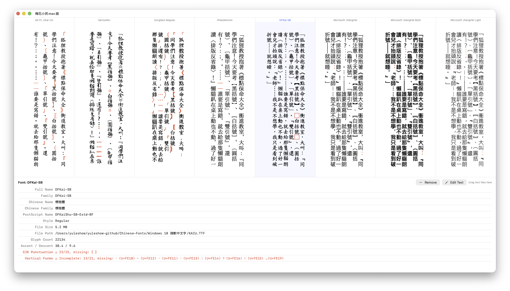

# Chinese Vertical / 梅花小民mac版

         

A macOS app for previewing Chinese vertical text with custom fonts.

## Screenshots

### Reading mode — paginated vertical layout

### Comparison mode — compare multiple fonts side by side

## Features

- Display text vertically (traditional Chinese vertical layout)
- Drag and drop font files to preview and compare them side by side
- View font metadata and vertical punctuation support details
- Read `.epub` and `.txt` books in paginated vertical layout
- Highlights missing glyphs (red) and wrong-rotation punctuation (orange)

## Requirements

- macOS 13.0+
- Xcode 15.0+

## Build

Open `ChineseVertical.xcodeproj` in Xcode and run (⌘R).

## Usage

### Compare fonts

1. Launch the app. A sample text with various CJK punctuation is displayed vertically using the system default font.
2. **Drag and drop** `.ttf`, `.otf`, `.ttc`, or `.dfont` files onto the window to load fonts.
3. Each dropped font appears as a new column, so you can compare multiple fonts side by side.
4. Click a font column to select it — the bottom panel shows font details (name, glyph count, vertical punctuation support, etc.).
5. Right-click a font column to remove it.

### Edit sample text

Click the **"Edit Text"** button in the toolbar to type your own sample text, then click **"Done"**.

### Read a book

1. Drag and drop an `.epub` or `.txt` file onto the window (or onto a specific font column) to enter **reading mode**.
2. The text is displayed in a paginated vertical layout using the selected font.
3. Navigate pages by:
   - Clicking the **left half** of the page → next page
   - Clicking the **right half** of the page → previous page
   - Using **← / →** arrow keys or **Page Up / Page Down**
4. Pinch or use **⌘+** / **⌘-** to adjust font size.
5. Click **"Back"** (top-left) to return to comparison mode.

### Font size

- **Pinch** trackpad gesture to zoom in/out
- **⌘+** / **⌘-** to increase/decrease font size
